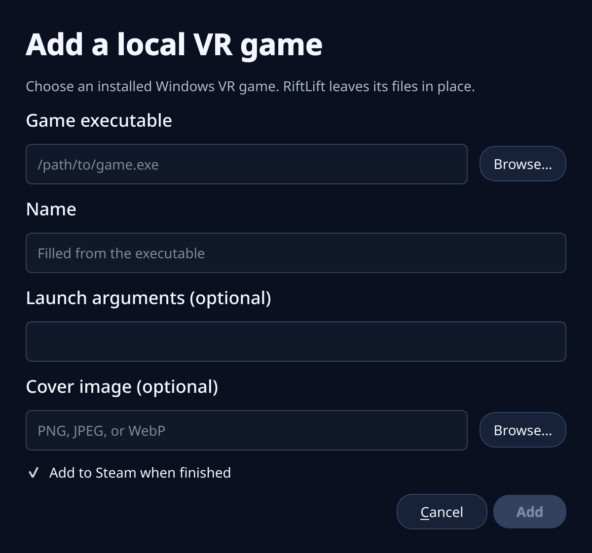

# RiftLift

**Play your Meta Rift (Oculus Rift) PC VR games on Linux.**

RiftLift is a Linux compatibility app for Meta Rift PC VR games. Its desktop
GUI handles Meta sign-in, owned-game downloads, Steam shortcuts, local playtime,
and launching through your existing VR headset setup. It supports Rift Store
releases and compatible Steam games that include an Oculus mode. RiftLift can
use SteamVR directly or a Monado-based OpenXR setup.


> [!WARNING]
> **RiftLift is alpha software.** Game compatibility is still expanding.

See the [compatibility wiki](docs/COMPATIBILITY.md) for games tested with real VR output.

## Quick start

Before you start, you need:

- a 64-bit Linux PC;
- Steam;
- a VR headset that already works through SteamVR or Monado/OpenXR; and
- a Meta account that owns a **Rift / PC VR** game.

Your headset must already run OpenXR apps. RiftLift does not install headset
drivers or Monado.

### 1. Install RiftLift

Download `riftlift-installer.sh` from the latest GitHub release, then run:

```bash
bash riftlift-installer.sh
```

The installer verifies its matching build, adds desktop integration, and
downloads the pinned compatibility components.

To install from a source checkout instead, run `./install.sh` in the repository.

### 2. Check your setup and sign in

Open **RiftLift** and click **System** to verify the setup.

Click **Sign In** and complete Meta's hosted sign-in page. Passwords and
security codes go only to Meta.


### 3. Add a game

Copy the URL of a game you own from the Meta **Rift / PC VR** store. Click
**Add Game** in RiftLift and paste it.


Leave **Add to Steam when finished** checked and click **Install**.

> A Quest-only purchase is not a Windows PC game. The store page must offer a
> Rift or PC VR build. Cross-buy titles work when the PC version is present on
> your Meta account.

### 4. Play

Select the game and click **Launch in VR**, or use its Steam shortcut. RiftLift
tracks playtime locally.

## Everyday use

The desktop app is the recommended way to use RiftLift:

- **System** checks whether RiftLift and your OpenXR setup are ready.
- **Sign In** opens Meta's sign-in flow.
- **Add Game** downloads an owned Rift game and optionally adds it to Steam.
- **Add a local game…** inside **Add Game** registers an existing Windows VR
  game without moving or copying it.
- **Steam Games** finds installed Steam titles with a compatible Oculus mode.
- **Launch in VR** starts the selected game through your active OpenXR runtime.
- Game details show the playtime RiftLift has tracked locally.
- The **⟳** button reloads games added elsewhere and refreshes store details
  and artwork.
- **View Activity** shows download, setup, launch, and diagnostic messages.

Steam may restart once when RiftLift adds or updates shortcuts.

## Troubleshooting

Start with **System** in the desktop app, or run `riftlift doctor`.

Doctor checks the graphics/XR stack, RiftLift components, games, and recent
launch evidence. It creates a redacted public paste; use `riftlift doctor
--no-paste` for local output only.

Common fixes:

- **RiftLift cannot find OpenXR:** start your normal Monado setup and try again.
- **Meta asks you to sign in again:** click **Sign In**, finish Meta's flow, and
  retry.
- **A game is missing from Steam:** close Steam, run `riftlift steam-sync`, and
  reopen it.
- **A game fails to launch:** enable **Debug logging** in the top bar, reproduce
  the problem once, then click **System**. RiftLift captures Proton, targeted
  Wine XR/Steam/Vulkan channels, DXVK, VKD3D, loader and crash diagnostics.
  Doctor correlates those files with game, Steam/XR, journal, kernel GPU and
  coredump evidence, then puts its likely cause and next steps before the raw
  excerpts. Retention rotates with the five-launch history, preserves both log
  headers and failure tails, and is capped at approximately 120 MiB.

When SteamVR is running, RiftLift uses Valve's OpenVR client and OpenXR runtime
directly; XRizer, Vapor, and OpenComposite are not part of that path. Otherwise
RiftLift uses Envision's selected Monado profile and its bundled XRizer only for
games that require OpenVR. Non-Envision runtimes can set `XR_RUNTIME_JSON`;
custom service startup can set `RIFTLIFT_LAUNCH_WRAPPER`.

## Updating RiftLift

From the RiftLift folder, run:

```bash
git pull --ff-only
./install.sh
```

Your sign-in and installed games are preserved.

## Command line (optional)

Everything in the desktop app is also available from the command line:

```bash
riftlift doctor                 # prints and creates a shareable diagnostic paste
riftlift login
riftlift add 'https://www.meta.com/experiences/APP_ID/'
riftlift add-local '/path/to/game.exe' --name 'My VR Game'
riftlift list
riftlift launch GAME-SLUG
```

Useful maintenance commands:

```bash
riftlift steam-sync
riftlift metadata
riftlift metadata GAME-SLUG --refresh
riftlift setup
```

Run `riftlift --help` or `riftlift COMMAND --help` for every option. Unusual
Rift Store manifests can use `riftlift add --executable PATH` and
`--arguments '...'`, but normal games should not need either override.
Download concurrency adapts to the CPUs available to RiftLift; use `--jobs` only
when you want to override it.

### Existing local games

For a Windows Oculus game installed outside Meta or Steam, choose **Add Game**,
then **Add a local game…**. Pick its `.exe`, give it a name, and optionally
choose cover art. RiftLift references the existing folder in place.



The command-line equivalent is:

```bash
riftlift add-local '/path/to/game.exe' --name 'My VR Game'
```

Use `--root` when the executable sits below the folder that contains the rest
of the game, or `--arguments` when the game documents required launch options.
`--app-key` is available for packages that publish an Oculus application key.

## Steam games with an Oculus mode

Some Windows VR games on Steam include an Oculus mode that RiftLift can send to
your Linux OpenXR headset. Steam still owns, installs, and updates these games;
RiftLift only adds the compatible launch path.

### Add an installed Steam game

1. Install the Windows VR game normally in Steam.
2. Open RiftLift and choose **Steam Games** at the top of the window.
3. Wait for the scan to finish, select the game, and choose **Add to RiftLift**.
   No game files are copied or downloaded.
4. Select the game in RiftLift's library and choose **Launch in VR**.


Games that are already in the RiftLift library are labeled clearly and can be
refreshed from the same screen. RiftLift gets their name, description,
developer, genres, store link, and official artwork from Steam. Use the library
**⟳** button whenever you want to refresh that information.

If a game does not appear, make sure it is fully installed, choose **Scan
again**, and confirm that its Windows version actually includes an Oculus mode.
Quest-only games and SteamVR/OpenVR-only games will not be listed.

RiftLift does not rely on a hand-maintained compatibility list. It checks each
installed game's manifest, engine layout, executable format, and bundled VR
runtime to detect compatible 64-bit Unity, Unreal, and native Oculus SDK games.

## Star history

<a href="https://www.star-history.com/?type=date&repos=Villagers654%2FRiftLift">
 <picture>
   <source media="(prefers-color-scheme: dark)" srcset="https://api.star-history.com/chart?repos=Villagers654/RiftLift&type=date&theme=dark&legend=top-left&sealed_token=vpFI0AQgUej_RbdUU8YiyenZTK4Yztdp64p7xfU8enm1_6nreoY8RC6_R6pb9Xt5IprDK8Wnsy-OOpIULPGKabYF5lu3DeJI8RPvEseMStENO9BmhSLT4JrCaiFTUAhlkr6m3kJyat-sHGo_oFTht_YW1VJq04oQBvI-rUdAWrkQURYzvz2MEhpzDOL0" />
   <source media="(prefers-color-scheme: light)" srcset="https://api.star-history.com/chart?repos=Villagers654/RiftLift&type=date&legend=top-left&sealed_token=vpFI0AQgUej_RbdUU8YiyenZTK4Yztdp64p7xfU8enm1_6nreoY8RC6_R6pb9Xt5IprDK8Wnsy-OOpIULPGKabYF5lu3DeJI8RPvEseMStENO9BmhSLT4JrCaiFTUAhlkr6m3kJyat-sHGo_oFTht_YW1VJq04oQBvI-rUdAWrkQURYzvz2MEhpzDOL0" />
   
 </picture>
</a>

## How RiftLift works

RiftLift keeps its files under `~/.local/share/riftlift` and uses one reusable
Proton environment. It combines:

- the built-in [Rift compatibility runtime](runtime);
- a pinned build of the maintained [RiftLift xrizer fork](https://github.com/Villagers654/xrizer),
  an OpenVR-to-OpenXR runtime;
- GE-Proton and WineOpenXR;
- Meta's native browser sign-in service and the PC runtime files games need;
- the entitlement-respecting
  [meta-pcvr-downloader](https://github.com/Villagers654/meta-pcvr-downloader);
  and
- a small compatibility bridge for older Oculus Platform SDK games.

RiftLift selects a rendering path from the runtimes bundled with each game:

```text
Oculus-only game -> RiftLift PE ABI -> Wine unixlib -> active OpenXR runtime
Oculus + OpenVR game -> RiftLift PE ABI -> Wine unixlib -> SteamVR directly
                    or -> bundled XRizer -> active Monado/OpenXR runtime
```

The PE portion exists because the games and their D3D graphics objects are
Windows binaries. XR runtime calls cross GE-Proton's supported in-process
`unixlib` boundary into native ELF code; RiftLift does not proxy them through a
helper daemon or Meta's Windows VR service.

RiftLift uses Meta's entitlement service before downloading a game. The legacy
Platform SDK bridge supplies local login and entitlement responses only for a
download whose ownership was already verified; other SDK calls continue to
Meta's original library. RiftLift is compatibility software, not a purchase or
DRM bypass.

Headset drivers, Monado, compositor lifecycle, and device-specific setup remain
the responsibility of the host VR setup.

The Rift compatibility runtime lives at the repository root under
[`runtime/`](runtime). The maintained [RiftLift xrizer fork](https://github.com/Villagers654/xrizer)
is pinned here as a Git submodule, keeping RiftLift's changes easy to compare
with [upstream xrizer](https://github.com/Supreeeme/xrizer). RiftLift's
top-level workflows build and bundle both components. Setup installs both
automatically; users do not need to install or configure xrizer separately.

### Credits

RiftLift's Oculus API translation work is derived from the GPL-licensed
[Revive project](https://github.com/LibreVR/Revive). RiftLift maintains that
code as part of its own runtime while preserving Revive's copyright and license
notices. Thanks to LibreVR and every Revive contributor whose work made this
compatibility layer possible.

## Legal and security

RiftLift is unaffiliated with Meta, Oculus, Valve, Collabora, or Sony. You must
own the games you download. Its cached Meta runtime token is readable only by
your user and is never included in diagnostic output. Downloads are pinned and
verified before extraction, archive paths are validated, and Steam's shortcut
file is backed up before an atomic replacement.

Expanded debug logs are stored inside RiftLift's user-private diagnostics
directory and may contain game or system details. Public doctor reports redact
credentials, email addresses, and home paths and include only selected excerpts.

RiftLift is GPL-3.0-or-later. Bundled and upstream components retain their own
licenses and notices.
