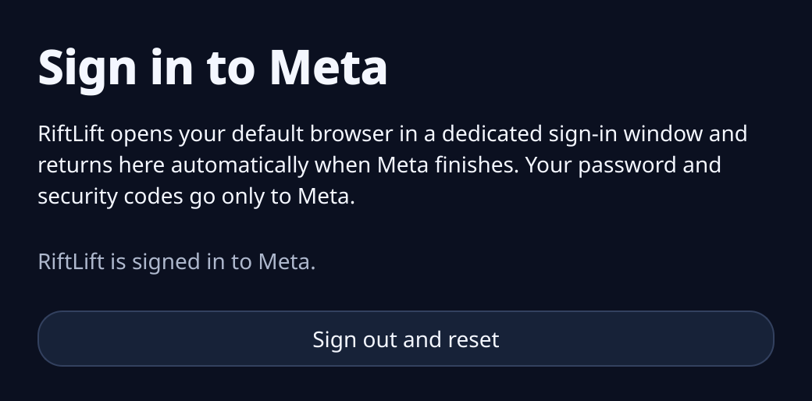
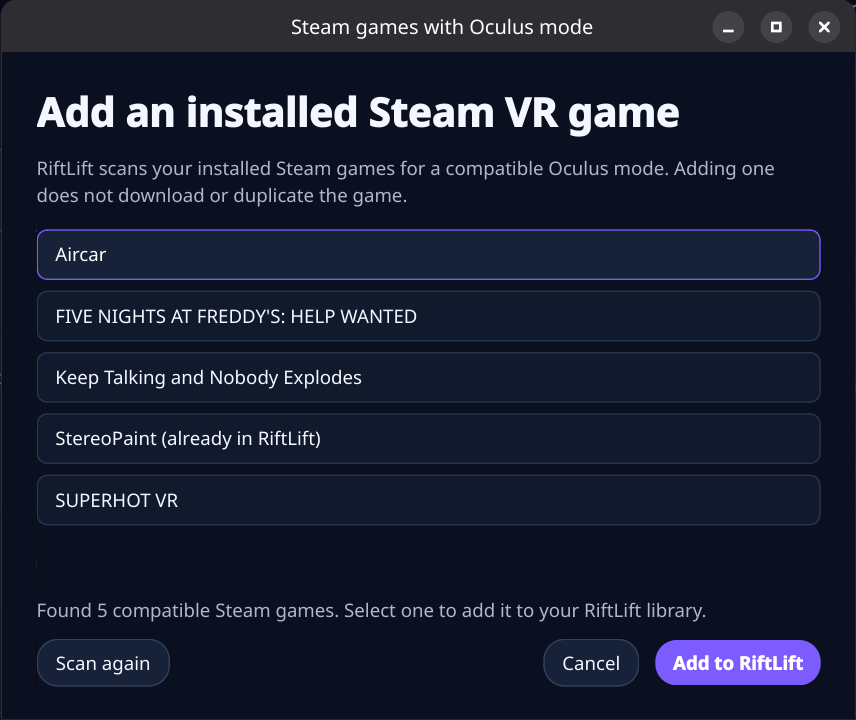

# RiftLift

**Play your Meta Rift PC VR games on Linux.**

RiftLift gives you one desktop app to sign in to Meta, download games you own,
add them to Steam, and launch them through your existing OpenXR headset setup.
If your headset works with Monado, SteamVR is not required.


> RiftLift is an early release. Many games work, but some titles may still need
> compatibility fixes.

## Quick start

Before you start, you need:

- a 64-bit Linux PC;
- Steam;
- a VR headset that already works through Monado/OpenXR; and
- a Meta account that owns a **Rift / PC VR** game.

Your headset must already run OpenXR apps. RiftLift does not install headset
drivers or Monado.

### 1. Install RiftLift

Open a terminal and paste:

```bash
git clone https://github.com/Villagers654/RiftLift.git
cd RiftLift
./install.sh
```

The first install can take a while while RiftLift downloads its shared
compatibility files. It will add **RiftLift** to your application menu.

### 2. Check your setup and sign in

Open **RiftLift** from your application menu and click **System**. If something
is not ready, open **View Activity** for the details.

Click **Sign In** and complete Meta's hosted sign-in page in the dedicated
default-browser window. RiftLift supports Firefox and Chromium-based browsers,
detects completion, and returns to the app automatically. Passwords and
security codes go only to Meta. Use **Account** to sign out or start over with
a clean browser session.



RiftLift follows the browser configured by your Linux desktop.

### 3. Add a game

Copy the URL of a game you own from the Meta **Rift / PC VR** store. Click
**Add Game** in RiftLift and paste it.


Leave **Add to Steam when finished** checked and click **Install**. Use
**View Activity** if you want to watch the download.

> A Quest-only purchase is not a Windows PC game. The store page must offer a
> Rift or PC VR build. Cross-buy titles work when the PC version is present on
> your Meta account.

### 4. Play

Select the game in RiftLift and click **Launch in VR**. You can also launch its
new shortcut from Steam or from a headset dashboard that reads your Steam VR
library, such as WayVR.

## Everyday use

The desktop app is the recommended way to use RiftLift:

- **System** checks whether RiftLift and your OpenXR setup are ready.
- **Sign In** opens Meta's sign-in flow.
- **Add Game** downloads an owned Rift game and optionally adds it to Steam.
- **Add a local game…** inside **Add Game** registers an existing Windows VR
  game without moving or copying it.
- **Steam Games** finds installed Steam titles with a compatible Oculus mode.
- **Launch in VR** starts the selected game through your active OpenXR runtime.
- The **⟳** button reloads games added elsewhere and refreshes store details
  and artwork.
- **View Activity** shows download, setup, launch, and diagnostic messages.

Steam may restart once when RiftLift adds or updates shortcuts.

## Troubleshooting

Start with **System** in the desktop app, or run `riftlift doctor`.

Doctor checks the Linux graphics/XR stack, RiftLift components, installed
games, and a small amount of recent launch/error evidence. It prints the
report and creates a shareable public paste automatically. Credentials, email
addresses, and home-directory paths are redacted; use `riftlift doctor
--no-paste` when you only want a local copy.

Common fixes:

- **RiftLift cannot find OpenXR:** start your normal Monado setup and try again.
- **Meta asks you to sign in again:** click **Sign In**, finish Meta's flow, and
  retry.
- **A game is missing from Steam:** close Steam, run `riftlift steam-sync`, and
  reopen it.
- **A game fails to launch:** run **System**, then retry from a terminal with
  `RIFTLIFT_PROTON_LOG=1 riftlift launch GAME-SLUG`.

For a nonstandard Monado manifest, set
`XR_RUNTIME_JSON=/path/to/openxr_monado.json` before opening RiftLift. If your
headset setup needs a special start command, set
`RIFTLIFT_LAUNCH_WRAPPER='your-runtime-start-wrapper'`.

## Updating RiftLift

From the RiftLift folder, run:

```bash
git pull --ff-only
./install.sh
```

Your sign-in and installed games are preserved.

## Command line (optional)

Everything in the desktop app is also available from the command line:

```bash
riftlift doctor                 # prints and creates a shareable diagnostic paste
riftlift login
riftlift add 'https://www.meta.com/experiences/APP_ID/'
riftlift add-local '/path/to/game.exe' --name 'My VR Game'
riftlift list
riftlift launch GAME-SLUG
```

Useful maintenance commands:

```bash
riftlift steam-sync
riftlift metadata
riftlift metadata GAME-SLUG --refresh
riftlift setup
```

Run `riftlift --help` or `riftlift COMMAND --help` for every option. Unusual
Rift Store manifests can use `riftlift add --executable PATH` and
`--arguments '...'`, but normal games should not need either override.
Download concurrency adapts to the CPUs available to RiftLift; use `--jobs` only
when you want to override it.

### Existing local games

For a Windows Oculus game installed outside Meta or Steam, choose **Add Game**,
then **Add a local game…**. Pick its `.exe`, give it a name, and optionally
choose cover art. RiftLift references the existing folder in place.

The command-line equivalent is:

```bash
riftlift add-local '/path/to/game.exe' --name 'My VR Game'
```

Use `--root` when the executable sits below the folder that contains the rest
of the game, or `--arguments` when the game documents required launch options.
`--app-key` is available for packages that publish an Oculus application key.

## Steam games with an Oculus mode

Some Windows VR games on Steam include an Oculus mode that RiftLift can send to
your Linux OpenXR headset. Steam still owns, installs, and updates these games;
RiftLift only adds the compatible launch path.

### Add an installed Steam game

1. Install the Windows VR game normally in Steam.
2. Open RiftLift and choose **Steam Games** at the top of the window.
3. Wait for the scan to finish, select the game, and choose **Add to RiftLift**.
   No game files are copied or downloaded.
4. Select the game in RiftLift's library and choose **Launch in VR**.



Games that are already in the RiftLift library are labeled clearly and can be
refreshed from the same screen. RiftLift gets their name, description,
developer, genres, store link, and official artwork from Steam. Use the library
**⟳** button whenever you want to refresh that information.

If a game does not appear, make sure it is fully installed, choose **Scan
again**, and confirm that its Windows version actually includes an Oculus mode.
Quest-only games and SteamVR/OpenVR-only games will not be listed.

RiftLift does not rely on a hand-maintained compatibility list. It checks each
installed game's manifest, engine layout, executable format, and bundled VR
runtime to detect compatible 64-bit Unity, Unreal, and native Oculus SDK games.

## Star history

<a href="https://www.star-history.com/?type=date&repos=Villagers654%2FRiftLift">
 <picture>
   <source media="(prefers-color-scheme: dark)" srcset="https://api.star-history.com/chart?repos=Villagers654/RiftLift&type=date&theme=dark&legend=top-left&sealed_token=vpFI0AQgUej_RbdUU8YiyenZTK4Yztdp64p7xfU8enm1_6nreoY8RC6_R6pb9Xt5IprDK8Wnsy-OOpIULPGKabYF5lu3DeJI8RPvEseMStENO9BmhSLT4JrCaiFTUAhlkr6m3kJyat-sHGo_oFTht_YW1VJq04oQBvI-rUdAWrkQURYzvz2MEhpzDOL0" />
   <source media="(prefers-color-scheme: light)" srcset="https://api.star-history.com/chart?repos=Villagers654/RiftLift&type=date&legend=top-left&sealed_token=vpFI0AQgUej_RbdUU8YiyenZTK4Yztdp64p7xfU8enm1_6nreoY8RC6_R6pb9Xt5IprDK8Wnsy-OOpIULPGKabYF5lu3DeJI8RPvEseMStENO9BmhSLT4JrCaiFTUAhlkr6m3kJyat-sHGo_oFTht_YW1VJq04oQBvI-rUdAWrkQURYzvz2MEhpzDOL0" />
   
 </picture>
</a>

## How RiftLift works

RiftLift keeps its files under `~/.local/share/riftlift` and uses one reusable
Proton environment. It combines:

- the in-repository [Revive and ReviveXR](components/revive) translation backends;
- the in-repository [xrizer](components/xrizer) OpenVR-to-OpenXR runtime;
- GE-Proton and WineOpenXR;
- Meta's native browser sign-in service and the PC runtime files games need;
- the entitlement-respecting
  [meta-pcvr-downloader](https://github.com/Villagers654/meta-pcvr-downloader);
  and
- a small compatibility bridge for older Oculus Platform SDK games.

RiftLift selects a rendering path from the runtimes bundled with each game:

```text
Oculus-only game -> RiftLift ReviveXR -> GE-Proton WineOpenXR -> OpenXR -> headset
Oculus + OpenVR game -> RiftLift Revive -> RiftLift xrizer -> OpenXR -> headset
```

RiftLift uses Meta's entitlement service before downloading a game. The legacy
Platform SDK bridge supplies local login and entitlement responses only for a
download whose ownership was already verified; other SDK calls continue to
Meta's original library. RiftLift is compatibility software, not a purchase or
DRM bypass.

Headset drivers, Monado, compositor lifecycle, and device-specific setup remain
the responsibility of the host VR setup. See
[Architecture and ownership](docs/ARCHITECTURE.md) for the technical boundary.

Revive, ReviveXR, and xrizer compatibility changes live in this repository
under [`components/`](components). Their builds and release artifacts are
produced by RiftLift's top-level workflows, so contributors do not need to
coordinate separate forks or releases.

## Legal and security

RiftLift is unaffiliated with Meta, Oculus, Valve, Collabora, or Sony. You must
own the games you download. Its cached Meta runtime token is readable only by
your user and is never included in diagnostic output. Downloads are pinned and
verified before extraction, archive paths are validated, and Steam's shortcut
file is backed up before an atomic replacement.

RiftLift is GPL-3.0-or-later. Bundled and upstream components retain their own
licenses and notices.
