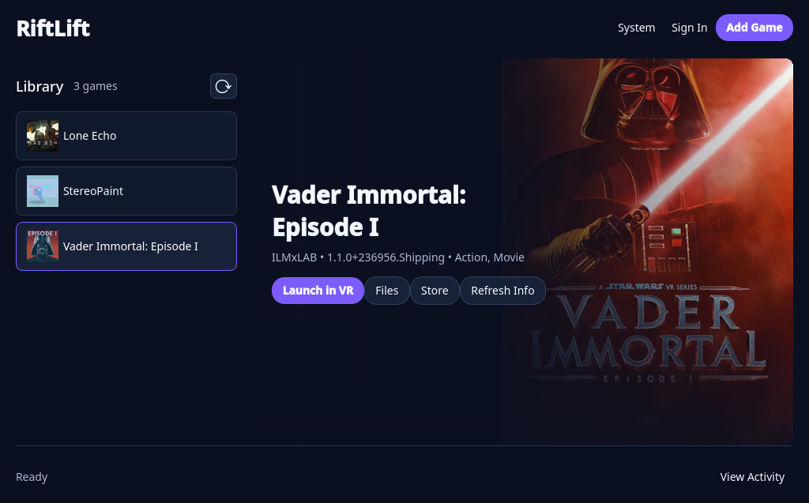
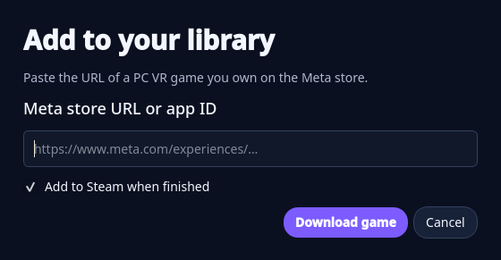

# RiftLift

Play the Meta Rift PC VR games you own on Linux with your existing OpenXR
headset setup. RiftLift handles the Windows compatibility tools, downloads,
Steam shortcuts, artwork, and launching from one desktop app. SteamVR is not
required when your headset already works with Monado.



> RiftLift is an early release. Many games work, but an individual title can
> still have a Windows-specific problem. If one does, click **System** and
> include the results when reporting it.

## Get your first Meta game running

You need:

- a 64-bit Linux PC;
- Steam;
- a VR headset that already works through Monado/OpenXR; and
- a Meta account that owns a **Rift / PC VR** game.

RiftLift does not install headset drivers or Monado. If you can already use an
OpenXR app with your headset, you are ready.

### 1. Install RiftLift

Open your terminal, copy this whole block, and press Enter:

```bash
git clone https://github.com/Villagers654/RiftLift.git
cd RiftLift
./install.sh
```

The first install can take a while. RiftLift downloads about 1 GiB of shared
compatibility tools, creates its own isolated game environment, and adds
**RiftLift** to your application menu. It does not replace your system Wine or
change your headset setup.

### 2. Open the RiftLift app

Open your desktop's application menu and choose **RiftLift**. You can also open
it from the terminal with `riftlift gui`.

Click **System**. When it finishes, **View Activity** shows each checked
component and whether it is ready.

### 3. Sign in to Meta

Click **Sign In** at the top of RiftLift. Meta Horizon Link will open in its own
window. Sign in normally and finish any browser or email confirmation Meta
requests, then return to RiftLift.

Your sign-in is saved in RiftLift's private game environment. You should not
need to sign in again for every game. If Meta expires the session later, click
**Sign In** again.

### 4. Add a game you own

Find the game's **Rift / PC VR** page on the Meta store and copy its web
address. In RiftLift, click **Add Game** and paste that address.



Leave **Add to Steam when finished** checked, then click **Download game**.
RiftLift confirms that your account owns the game, downloads and verifies it,
and adds its name and artwork to Steam. Large games may take some time; click
**View Activity** to see progress.

> A Quest-only purchase is not a Windows PC game. The store page must offer a
> Rift or PC VR build. Cross-buy titles work when the PC version is present on
> your Meta account.

### 5. Put on your headset and play

Select the game in RiftLift and click **Launch in VR**. You can also launch its
new shortcut from Steam or from a headset dashboard that reads your Steam VR
library, such as WayVR.

That is the complete everyday workflow: open RiftLift, add a game, and launch
it. Every Rift Store game shares the same compatibility setup and persistent
Meta sign-in.

## Using the desktop app

The desktop app is the recommended way to use RiftLift:

- **System** checks OpenXR, Steam, Proton, Revive, Meta sign-in support,
  and every installed game without exposing account secrets.
- **Sign In** opens Meta's sign-in flow in RiftLift's persistent environment.
- **Add Game** downloads an owned Rift game and optionally adds it to Steam.
- **Launch in VR** starts the selected game through your active OpenXR runtime.
- **Refresh Info** downloads updated store details and artwork.
- **Refresh** reloads games that were added or changed elsewhere.
- **View Activity** shows download, setup, launch, and diagnostic messages.

Steam may restart once when RiftLift adds or updates shortcuts. This prevents
Steam from overwriting the new library entry.

## Command-line setup and use

Everything in the desktop app is also available from the command line. This is
useful for remote machines, scripts, troubleshooting, or people who simply
prefer a terminal.

Install RiftLift with the same installer shown above, then use:

```bash
# Check that your OpenXR and compatibility setup is ready
riftlift doctor

# Sign in to Meta once
riftlift login

# Download an owned Rift game and add it to Steam
riftlift add 'https://www.meta.com/experiences/APP_ID/'

# Show installed games and their launch names
riftlift list

# Launch one of those games
riftlift launch GAME-SLUG
```

Useful maintenance commands:

```bash
# Rebuild RiftLift's Steam shortcuts
riftlift steam-sync

# Fill in missing artwork and store information
riftlift metadata

# Refresh one game's cached artwork and information
riftlift metadata GAME-SLUG --refresh

# Reinstall or update the shared compatibility tools
riftlift setup
```

Run `riftlift --help` or `riftlift COMMAND --help` for every option. Unusual
Rift Store manifests can use `riftlift add --executable PATH` and
`--arguments '...'`, but normal games should not need either override.
Download concurrency adapts to the CPUs available to RiftLift; use `--jobs` only
when you want to override it.

## Games bought through Steam

Some Steam games include an Oculus mode even though they were not downloaded
from the Meta store. Install those games normally in Steam. RiftLift can detect
64-bit Unity, Unreal, and native Oculus SDK games with:

```bash
riftlift steam-oculus-ids
```

A headset integration can route those Steam app IDs through:

```bash
riftlift launch-steam APP_ID -- %command%
```

This keeps Steam ownership, updates, achievements, artwork, and its normal Play
button. If a game offers both Oculus and SteamVR/OpenVR modes, RiftLift respects
the mode selected in Steam instead of forcing Oculus mode.

For these games, RiftLift reads the title, description, developer, genres, and
official library artwork from the Steam catalog instead of treating the Steam
app ID as a Meta store ID. **Refresh Info** updates that cached Steam data and
portrait artwork at any time.

RiftLift does not keep a list of specially supported titles. It uses the
game's own manifest, engine layout, executable format, and Steam launch command
to find the correct 64-bit game executable and arguments.

## Troubleshooting

Start with **System** in the desktop app, or run:

```bash
riftlift doctor
```

Common fixes:

- **RiftLift cannot find OpenXR:** start your normal Monado setup and try again.
  RiftLift uses the active OpenXR runtime; it does not start headset drivers.
- **Meta asks you to sign in again:** click **Sign in**, finish Meta's flow, and
  retry the download.
- **A game is missing from Steam:** close Steam, run `riftlift steam-sync`, and
  reopen it. RiftLift normally handles this restart automatically.
- **A game fails to launch:** run **System**, then enable a Proton log with
  `RIFTLIFT_PROTON_LOG=1 riftlift launch GAME-SLUG`.
- **Your headset setup needs a special start command:** set
  `RIFTLIFT_LAUNCH_WRAPPER='your-runtime-start-wrapper'`. A normally running
  Monado setup does not need this.

If your working Monado installation uses a nonstandard runtime manifest, set
`XR_RUNTIME_JSON=/path/to/openxr_monado.json` before opening RiftLift.

## Updating RiftLift

From the RiftLift folder, run:

```bash
git pull --ff-only
./install.sh
```

Updating preserves your Meta sign-in and installed games. Already downloaded,
checksum-verified tools are reused when possible.

## What RiftLift installs

RiftLift keeps its files under `~/.local/share/riftlift` and uses one reusable
Proton environment. It combines:

- the maintained [RiftLift Revive](https://github.com/Villagers654/Revive) fork;
- GE-Proton and WineOpenXR;
- the parts of Meta's PC client needed for account sign-in;
- the entitlement-respecting
  [meta-pcvr-downloader](https://github.com/Villagers654/meta-pcvr-downloader);
  and
- a small compatibility bridge for older Oculus Platform SDK games.

The rendering path is:

```text
Rift game -> RiftLift ReviveXR -> GE-Proton WineOpenXR -> your OpenXR runtime -> headset
```

RiftLift uses Meta's entitlement service before downloading a game. The legacy
Platform SDK bridge supplies local login and entitlement responses only for a
download whose ownership was already verified; other SDK calls continue to
Meta's original library. RiftLift is compatibility software, not a purchase or
DRM bypass.

Headset drivers, Monado, compositor lifecycle, and device-specific setup remain
the responsibility of the host VR setup. See
[Architecture and ownership](docs/ARCHITECTURE.md) for the technical boundary.

## Legal and security

RiftLift is unaffiliated with Meta, Oculus, Valve, Collabora, or Sony. You must
own the games you download. Its cached Meta runtime token is readable only by
your user and is never included in diagnostic output. Downloads are pinned and
verified before extraction, archive paths are validated, and Steam's shortcut
file is backed up before an atomic replacement.

RiftLift is GPL-3.0-or-later. Bundled and upstream components retain their own
licenses and notices.
